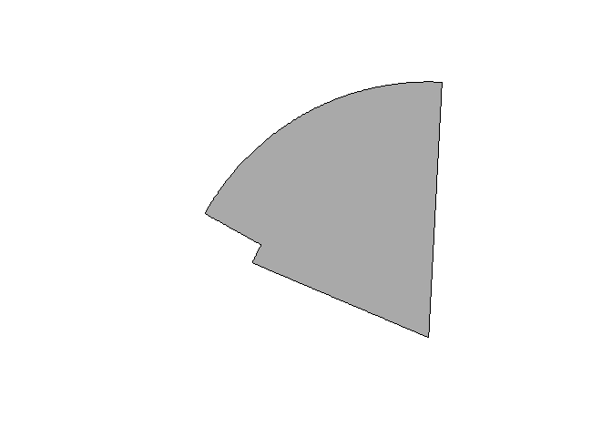

[](https://travis-ci.org/mdsumner/cconvention) [](https://ci.appveyor.com/project/mdsumner/cconvention) [](https://codecov.io/github/mdsumner/cconvention?branch=master)

<!-- README.md is generated from README.Rmd. Please edit that file -->
cconvention
===========

The goal of cconvention is to provide access to the CCAMLR convention in spatial form, from scratch.

Installation
------------

You can install cconvention from github with:

``` r
# install.packages("devtools")
devtools::install_github("mdsumner/cconvention")
```

Example
-------

This is a basic example which loads an in-built data set.

``` r
library(cconvention)
subarea <- division()

library(sp)
library(rgdal)
#> rgdal: version: 1.2-4, (SVN revision 643)
#>  Geospatial Data Abstraction Library extensions to R successfully loaded
#>  Loaded GDAL runtime: GDAL 2.0.1, released 2015/09/15
#>  Path to GDAL shared files: C:/Users/mdsumner/Documents/R/win-library/3.3/rgdal/gdal
#>  Loaded PROJ.4 runtime: Rel. 4.9.2, 08 September 2015, [PJ_VERSION: 492]
#>  Path to PROJ.4 shared files: C:/Users/mdsumner/Documents/R/win-library/3.3/rgdal/proj
#>  Linking to sp version: 1.2-3
p <- spTransform(subarea, "+proj=laea +lon_0=147 +lat_0=-90 +ellps=WGS84 +no_defs")
plot(p, col = "darkgrey")
```


